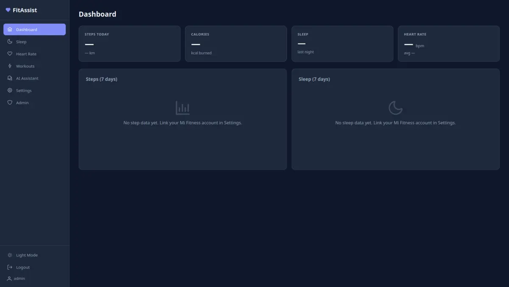

# FitAssist

Self-hosted AI health assistant that connects to Mi Fitness (Xiaomi/Amazfit wearables), stores your health data, and provides AI-powered analysis and recommendations.



## Features

- **Mi Fitness Integration** — Syncs steps, sleep, heart rate, SpO2, stress, and workouts from your Mi Band/Amazfit device via the Huami API
- **Web Dashboard** — Vue 3 frontend with interactive charts for all health metrics
- **AI Assistant** — Chat with Claude AI about your health data, get personalized recommendations (WebSocket streaming)
- **Telegram Bot** — View data, trigger syncs, and ask AI questions directly from Telegram
- **Multi-user** — JWT authentication, admin panel, Telegram chat approval flow
- **Smart Notifications** — AI-powered post-workout and sleep analysis via Telegram, configurable daily/weekly health summaries
- **Auto-sync** — Configurable cron scheduler pulls data automatically
- **Data Export** — PostgreSQL dump from the admin panel
- **Docker Ready** — Multi-stage Dockerfile, docker-compose for one-command deployment

## Tech Stack

| Layer | Technology |
|-------|-----------|
| Backend | Go 1.25, Chi router, sqlx |
| Frontend | Vue 3, TypeScript, Vite, PrimeVue, ECharts |
| Database | PostgreSQL 16 |
| AI | Claude API (Anthropic SDK) |
| Bot | go-telegram/bot |
| Auth | JWT (access + refresh tokens), bcrypt, AES-256-GCM |
| Infra | Docker, docker-compose |

## Project Structure

```
fitassist/
├── cmd/fitassist/          # Application entry point
├── config/                 # Configuration files (config.json)
├── deployments/            # Dockerfile, docker-compose, .env
├── migrations/             # PostgreSQL migrations
├── internal/
│   ├── ai/                 # Claude API client, health context builder
│   ├── config/             # Viper config loader
│   ├── cron/               # Sync scheduler
│   ├── crypto/             # AES-256-GCM encryption
│   ├── database/           # PostgreSQL connection, migrations
│   ├── handler/            # HTTP handlers, middleware, rate limiter
│   ├── mifit/              # Mi Fitness API client (auth, data decode)
│   ├── model/              # Domain models
│   ├── repository/         # Database queries
│   ├── server/             # HTTP server setup, routing
│   ├── service/            # Business logic (auth, sync, health)
│   └── telegram/           # Telegram bot handlers
└── web/                    # Vue 3 frontend
    └── src/
        ├── api/            # Axios API client
        ├── components/     # Layout, shared components
        ├── stores/         # Pinia stores (auth, theme)
        └── views/          # Page components
```

## Prerequisites

- **Go 1.25+**
- **Node.js 20+** (for frontend build)
- **PostgreSQL 16** (or Docker)
- **Mi Fitness account** — you need a Xiaomi account linked to the Mi Fitness app
- **Claude API key** (optional) — for AI assistant features
- **Telegram Bot Token** (optional) — for Telegram integration

## Quick Start (Local Development)

### 1. Clone and install dependencies

```bash
git clone https://github.com/mikebionic/fitassist.git
cd fitassist
go mod download
cd web && npm install && cd ..
```

### 2. Start PostgreSQL

Option A — Docker (recommended):
```bash
docker run -d --name fitassist-pg \
  -e POSTGRES_DB=fitassist \
  -e POSTGRES_USER=fitassist \
  -e POSTGRES_PASSWORD=devpassword \
  -p 5433:5432 \
  postgres:16-alpine
```

Option B — Use docker-compose dev file:
```bash
docker compose -f deployments/docker-compose.dev.yml up -d
```

### 3. Create config file

```bash
cp config/config.example.json config/config.json
```

Edit `config/config.json` with your values:

```jsonc
{
  "server": {
    "port": 8080           // change if 8080 is occupied
  },
  "database": {
    "host": "127.0.0.1",
    "port": 5433,          // match your PostgreSQL port
    "password": "devpassword"
  },
  "security": {
    "jwt_secret": "",      // REQUIRED — see below
    "encryption_key": ""   // REQUIRED — see below
  },
  "admin": {
    "initial_username": "admin",
    "initial_password": "your-admin-password"  // REQUIRED
  },
  // Optional features:
  "claude": {
    "api_key": "sk-ant-..."  // get from console.anthropic.com
  },
  "telegram": {
    "enabled": true,
    "bot_token": "123456:ABC..."  // get from @BotFather
  }
}
```

### 4. Generate required secrets

```bash
# Generate JWT secret (random 32+ chars)
openssl rand -base64 32

# Generate AES-256 encryption key (64 hex chars)
openssl rand -hex 32
```

Put these values in your `config/config.json` under `security.jwt_secret` and `security.encryption_key`.

### 5. Build and run

```bash
# Build frontend
cd web && npm run build && cd ..

# Run backend (auto-migrates database on first start)
go run ./cmd/fitassist/
```

Open http://localhost:8080 (or your configured port). Log in with the admin credentials you set.

### 6. Link your Mi Fitness account

Go to **Settings** in the web UI and enter your Xiaomi account email and password. The app will verify your credentials, encrypt and store them, and start syncing your data.

## Docker Deployment (Production)

### 1. Set up environment

```bash
cd deployments
cp .env.example .env
```

### 2. Edit `.env` with your production values

```bash
# REQUIRED — you must set these:
DB_PASSWORD=your-strong-db-password
JWT_SECRET=your-random-secret-at-least-32-characters-long
ENCRYPTION_KEY=<output of: openssl rand -hex 32>
ADMIN_PASSWORD=your-admin-password

# Optional:
CLAUDE_API_KEY=sk-ant-...
TELEGRAM_ENABLED=true
TELEGRAM_BOT_TOKEN=123456:ABC...
```

### 3. Deploy

```bash
docker compose up -d
```

This starts:
- **app** — Go backend + Vue frontend on port 8080
- **postgres** — PostgreSQL 16 with persistent data volume

The app auto-migrates the database and creates the initial admin user on first start.

### 4. Access

Open `http://your-server:8080` and log in.

## Configuration Reference

Configuration is loaded with priority: **environment variables > config.json > defaults**.

| Setting | Env Var | Default | Description |
|---------|---------|---------|-------------|
| `server.port` | `SERVER_PORT` | `8080` | HTTP port |
| `server.mode` | `SERVER_MODE` | `development` | `development` or `production` |
| `database.host` | `DB_HOST` | `localhost` | PostgreSQL host |
| `database.port` | `DB_PORT` | `5432` | PostgreSQL port |
| `database.name` | `DB_NAME` | `fitassist` | Database name |
| `database.user` | `DB_USER` | `fitassist` | Database user |
| `database.password` | `DB_PASSWORD` | — | Database password |
| `database.auto_migrate` | `DB_AUTO_MIGRATE` | `true` | Run migrations on startup |
| `security.jwt_secret` | `JWT_SECRET` | — | **Required.** JWT signing key |
| `security.encryption_key` | `ENCRYPTION_KEY` | — | **Required.** AES-256 key (hex, 64 chars) |
| `security.cors_origins` | — | `["http://localhost:5173"]` | Allowed CORS origins |
| `admin.initial_username` | `ADMIN_USERNAME` | `admin` | First admin username |
| `admin.initial_password` | `ADMIN_PASSWORD` | — | First admin password |
| `claude.api_key` | `CLAUDE_API_KEY` | — | Anthropic API key |
| `claude.model` | `CLAUDE_MODEL` | `claude-sonnet-4-5-20250929` | Claude model |
| `claude.max_tokens` | `CLAUDE_MAX_TOKENS` | `4096` | Max response tokens |
| `telegram.enabled` | `TELEGRAM_ENABLED` | `false` | Enable Telegram bot |
| `telegram.bot_token` | `TELEGRAM_BOT_TOKEN` | — | Bot token from @BotFather |
| `mifit.sync_interval_minutes` | `MIFIT_SYNC_INTERVAL` | `30` | Auto-sync interval (0 = disabled) |

## What You Need Before Running

Here's a checklist of what to prepare:

1. **PostgreSQL database** — either via Docker or an existing server
2. **JWT secret** — generate with `openssl rand -base64 32`
3. **Encryption key** — generate with `openssl rand -hex 32`
4. **Admin password** — choose a password for the initial admin account
5. **Mi Fitness account** (for health data) — your Xiaomi/Mi account email and password
6. **Claude API key** (optional, for AI features) — sign up at [console.anthropic.com](https://console.anthropic.com)
7. **Telegram Bot Token** (optional) — create a bot via [@BotFather](https://t.me/BotFather)

## API Endpoints

### Public
| Method | Path | Description |
|--------|------|-------------|
| POST | `/api/auth/register` | Register new user |
| POST | `/api/auth/login` | Login, get JWT tokens |
| POST | `/api/auth/refresh` | Refresh access token |
| GET | `/api/health` | Health check |

### Protected (requires JWT)
| Method | Path | Description |
|--------|------|-------------|
| GET | `/api/health/dashboard` | Today's summary |
| GET | `/api/health/steps?from=&to=` | Steps data |
| GET | `/api/health/sleep?from=&to=` | Sleep data |
| GET | `/api/health/heartrate?from=&to=` | Heart rate data |
| GET | `/api/health/spo2?from=&to=` | SpO2 data |
| GET | `/api/health/workouts?from=&to=` | Workouts list |
| GET | `/api/health/workouts/{id}` | Workout details |
| GET | `/api/health/stress?from=&to=` | Stress data |
| POST | `/api/mifit/link` | Link Mi Fitness account |
| POST | `/api/mifit/sync` | Trigger manual sync |
| GET | `/api/mifit/status` | Mi Fitness account status |
| GET | `/api/ai/sessions` | List AI chat sessions |
| POST | `/api/ai/sessions` | Create new AI session |
| GET | `/api/ai/sessions/{id}` | Get session with messages |
| DELETE | `/api/ai/sessions/{id}` | Delete session |
| POST | `/api/ai/sessions/{id}/messages` | Send message to AI |
| POST | `/api/ai/summary` | Quick AI health summary |
| WS | `/ws/ai/chat?token=` | WebSocket streaming AI chat |

### Admin
| Method | Path | Description |
|--------|------|-------------|
| GET | `/api/admin/users` | List users |
| PATCH | `/api/admin/users/{id}` | Update user |
| GET | `/api/admin/chats` | List Telegram chats |
| PATCH | `/api/admin/chats/{id}` | Approve/block chat |
| GET | `/api/admin/sync-logs` | Sync history |
| GET | `/api/admin/export?format=sql` | Database export |

## Telegram Bot Commands

| Command | Description |
|---------|-------------|
| `/start` | Register chat, request approval |
| `/link` | Link Mi Fitness account |
| `/today` | Today's health summary |
| `/week` | Weekly summary |
| `/sleep` | Last night's sleep breakdown |
| `/hr` | Heart rate info |
| `/workout` | Last workout details |
| `/sync` | Trigger data sync |
| `/notify` | Notification settings (daily/weekly summaries, workout/sleep analysis) |
| `/ai <question>` | Ask AI about your health |
| `/help` | Show commands |

## Running Tests

```bash
go test ./... -v
```

## Troubleshooting

**Port already in use:** Change `server.port` in config.json or set `SERVER_PORT` env var.

**Database connection refused:** Check that PostgreSQL is running and the host/port/password match your config.

**Mi Fitness sync fails:** The Huami API occasionally changes endpoints. Check that `mifit.api_base_url` is correct. Your Xiaomi account must use email/password login (not phone number).

**AI not responding:** Verify your `claude.api_key` is valid and has credits at console.anthropic.com.

**Telegram bot not starting:** Ensure `telegram.enabled` is `true` and the bot token is valid. The bot needs to be started by messaging `/start` in your chat with it.

## License

MIT
